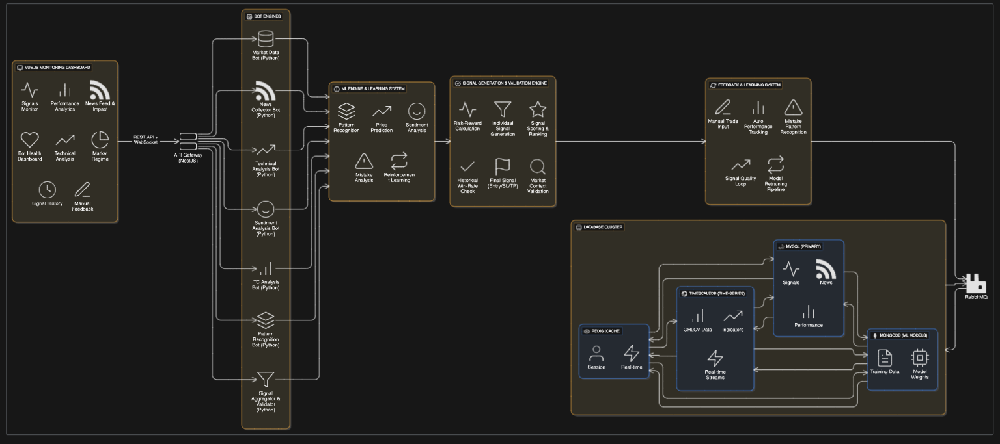

# 🚀 Crypto Trading Signal System

> Advanced cryptocurrency trading signal generation system with machine learning, ICT concepts, and multi-bot architecture.

---

## 📋 Table of Contents

- [Overview](#overview)
- [Key Features](#key-features)
- [System Architecture](#system-architecture)
- [Technology Stack](#technology-stack)
- [Prerequisites](#prerequisites)
- [Quick Start](#quick-start)
- [Project Structure](#project-structure)
- [Configuration](#configuration)
- [Usage](#usage)
- [API Documentation](#api-documentation)
- [Contributing](#contributing)
- [License](#license)
- [Support](#support)

---

## 🎯 Overview

This system generates high-quality cryptocurrency trading signals using a microservices architecture. It combines:

- **Technical Analysis** (RSI, MACD, Bollinger Bands, etc.)
- **Sentiment Analysis** (News, Social Media)
- **ICT Concepts** (Order Blocks, Fair Value Gaps, Liquidity Zones)
- **Machine Learning** (LSTM, Transformers, Reinforcement Learning)
- **Pattern Recognition** (Chart patterns, Candlestick patterns)

**Key Goal:** Generate signals with minimum 1:4 Risk-Reward ratio and >60% win rate.

---

## ✨ Key Features

### 🤖 **Multi-Bot Architecture**
- **Market Data Bot** - Real-time price data collection
- **News Collector Bot** - Multi-source news aggregation
- **Technical Analysis Bot** - 30+ technical indicators
- **Sentiment Analysis Bot** - NLP-powered sentiment scoring
- **ICT Analysis Bot** - Smart Money Concepts
- **Pattern Recognition Bot** - ML-powered pattern detection
- **Signal Aggregator Bot** - Multi-layer signal validation
- **ML Learning Engine** - Continuous model improvement
- **Feedback Processor Bot** - Learn from mistakes

### 📊 **Advanced Analytics**
- Multi-timeframe confluence analysis
- Market regime detection (Bull/Bear/Sideways)
- Volume profile analysis
- Correlation-based risk management
- Dynamic position sizing

### 🎨 **Real-time Dashboard**
- Live signal monitoring
- Interactive TradingView-style charts
- News feed with impact analysis
- Performance analytics
- Bot health monitoring

### 🧠 **Machine Learning**
- LSTM price prediction
- Transformer models
- Reinforcement learning for optimization
- Automated mistake learning
- A/B testing framework

### 🔒 **Security**
- JWT authentication
- Rate limiting
- Input validation
- Encrypted database connections
- API key management
